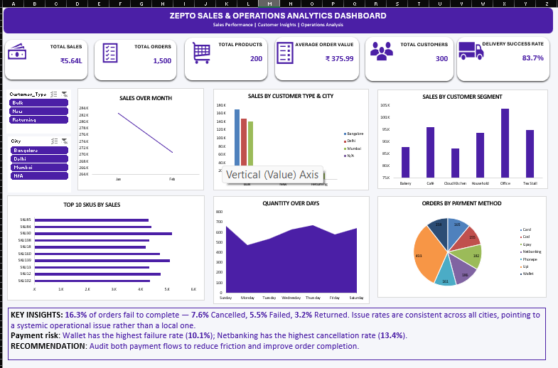

# 🛒 Zepto Sales & Operations Analytics Dashboard

An interactive Excel dashboard analyzing sales performance, customer behavior, and delivery operations for a quick-commerce (Zepto-style) grocery business.

## 🔑 Key Metrics (KPIs)

| Metric | Value |
|---|---|
| Total Sales | ₹5.64L |
| Total Orders | 1,500 |
| Total Products | 200 |
| Average Order Value | ₹375.99 |
| Total Customers | 300 |
| Total Quantity | 4,207 |
| Delivery Success Rate | 83.7% |

## 📈 Dashboard Features

- **Sales Over Month** — Trend of total sales across the reporting period
- **Sales by Customer Type & City** — Breakdown across Bangalore, Delhi, Mumbai, and other cities by customer type (Bulk, New, Returning)
- **Sales by Customer Segment** — Performance across Bakery, Café, Cloud Kitchen, Household, Office, and Tea Stall segments
- **Top 10 SKUs by Sales** — Best-selling products ranked by revenue
- **Quantity Over Days** — Order volume trend across each day of the week
- **Orders by Payment Method** — Split across Card, Cash, Gpay, Netbanking, Phonepe, UPI, and Wallet
- **Interactive Slicers** — Filter the dashboard by Customer Type and City
- **Key Insights & Recommendations** — Delivery issue-rate analysis and payment-risk callouts

## 🗂️ Data Source

Raw order-level transaction data (`RAW_DATA` sheet) including:

- Order ID, order date, customer name/type/segment
- City and payment method
- SKU, product name, category (Veg/Non-Veg etc.)
- Quantity, price, discount, subtotal, tax, delivery fee
- Delivery status and delivery time
- Derived month/weekday fields for trend analysis

## 🛠️ Tools Used

- **Microsoft Excel** — PivotTables, PivotCharts, slicers, and KPI formulas
- Data cleaning and transformation on raw order-level transaction data

## 📁 Repository Contents

| File | Description |
|---|---|
| `Zepto_Sales_Dashboard.xlsx` | Full Excel workbook with raw data, pivot analysis, KPI sheet, and dashboard |
| `dashboard_screenshot.png` | Preview image of the dashboard |
| `README.md` | Project documentation (this file) |

## 🚀 How to Use

1. Download `Zepto_Sales_Dashboard.xlsx`
2. Open in Microsoft Excel (Excel 2016+ recommended for full slicer/PivotChart support)
3. Use the **Customer Type** and **City** slicers on the dashboard tab to filter the view interactively

## 💡 Key Insights

- **16.3% of orders fail to complete** — 7.6% Cancelled, 5.5% Failed, 3.2% Returned. Issue rates are consistent across all cities, pointing to a systemic operational issue rather than a local one.
- **Payment risk**: Wallet has the highest failure rate (10.1%); Netbanking has the highest cancellation rate (13.4%).
- **Recommendation**: Audit both payment flows (Wallet and Netbanking) to reduce friction and improve order completion.

---
*Dataset: Simulated quick-commerce (Zepto-style) order and delivery data for BI/dashboarding practice.*
